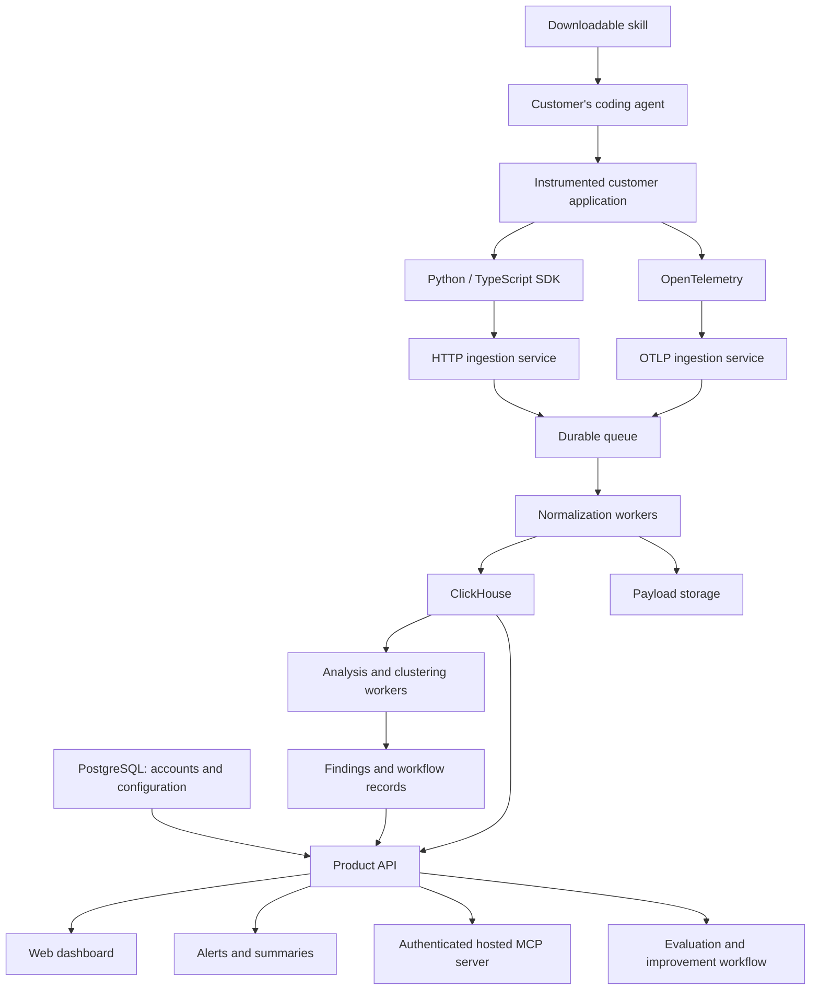

# Tervik

Skill-installed analytics for AI agents. Find failures. Build better agents.

**Complete roadmap for an Agnost-style product**

**1. Define the product and customer experience**

Your product should help teams answer four questions:

- What are users trying to accomplish?
- Where is the agent failing or frustrating them?
- Which problems affect the most users?
- Does a proposed change actually improve the agent?

The main customer journey should be:

**Install skill → connect account → instrument application → verify real traffic → discover problems → investigate evidence → test a fix → approve delivery → measure results.**

The public installation experience should have the same two-step structure as the reference:

```bash
npx skills add YOUR_ORG/skills --skill YOUR_PRODUCT
```

```text
Use the YOUR_PRODUCT skill to add YOUR_PRODUCT analytics.
```

These commands become usable after you publish your repository and skill.

The skill configures the integration. Your SDK or OpenTelemetry instrumentation continues sending telemetry when the customer’s application runs.

**2. Establish the architecture and technology choices**

Use this stack as the implementation baseline:

| Component | Technology | Basis |
|---|---|---|
| Downloadable integration skill | `SKILL.md`, references, Node.js helper scripts | Confirmed Agnost approach |
| TypeScript SDK | TypeScript, tsup, Vitest | Confirmed Agnost SDK tooling |
| Python SDK | Python package with buffered HTTP delivery | Matches Agnost’s public integration model |
| Telemetry interfaces | HTTP ingestion and OpenTelemetry/OTLP | Confirmed Agnost interfaces |
| Analytics database | ClickHouse | Confirmed |
| Discovery approach | Embeddings, cosine-drift segmentation, BIRCH, HDBSCAN-like clustering | Founder-described approach |
| Dashboard | React, TypeScript, Vite, Tailwind, Lucide | Proposed implementation; exact framework unconfirmed |
| Product API and ingestion services | Python, FastAPI | Proposed |
| Background processing | NATS JetStream and Python workers | Proposed |
| Accounts and configuration | PostgreSQL | Proposed |
| Payloads and evaluation artifacts | S3-compatible storage | Proposed |
| Analysis implementation | scikit-learn plus embedding/classifier/model adapters | Proposed |
| Local environment | Docker Compose | Proposed |
| Production deployment | Managed containers and managed data services | Proposed |

Agnost’s public tests establish separate development services for the backend, ingestion, and OTel, alongside ClickHouse. Its main server language and queue technology remain undisclosed. [Development services](https://github.com/AgnostAI/skills/blob/main/test/run-sandboxes.sh), [ClickHouse verification](https://github.com/AgnostAI/skills/blob/main/test/verify.mjs)

For your queue, JetStream provides persistence and redelivery. Consumers must still handle duplicate delivery correctly. [JetStream documentation](https://docs.nats.io/concepts/jetstream)

Use this logical architecture:



This is your proposed implementation of the documented patterns, rather than Agnost’s exact deployment topology.

**3. Create the project structure**

Keep the platform and published integration packages in one development repository initially:

```text
product/
├── apps/
│   └── dashboard/
├── services/
│   ├── api/
│   ├── ingest/
│   ├── otlp/
│   └── mcp/
├── workers/
│   ├── normalize/
│   ├── analyze/
│   ├── cluster/
│   ├── alert/
│   └── evaluate/
├── packages/
│   ├── sdk-typescript/
│   └── sdk-python/
├── skills/
│   └── YOUR_PRODUCT/
│       ├── SKILL.md
│       ├── references/
│       └── scripts/
├── database/
│   ├── postgres/
│   └── clickhouse/
├── tests/
│   ├── fixtures/
│   └── integration/
└── infrastructure/
```

Publish the skill from a public repository. Publish SDKs through npm and PyPI. Release and version them independently from the hosted application.

**4. Phase 1 — specification and foundation, weeks 1–2**

Create a feature matrix covering the website, skill, SDKs, dashboard, analysis, alerts, evaluations, improvements, billing, and administration.

Each feature needs a description, dependencies, and a completion test.

Define the data model before building the dashboard:

| Data | Purpose |
|---|---|
| Organizations, projects, environments | Ownership and isolation |
| Users and agent versions | Attribution and comparisons |
| Conversations and messages | Ordered user-agent interactions |
| Traces and spans | Nested technical operations |
| Tool executions and outcome signals | Actions and observed results |
| Intents and behavior rules | Customer-specific definitions |
| Findings and evidence references | Classified issues |
| Clusters and memberships | Recurring patterns |
| Alerts and deliveries | Notifications |
| Evaluation datasets and runs | Baseline/candidate comparisons |
| Improvements and deployments | Proposed changes and outcomes |
| Usage and audit records | Commercial and administrative controls |

Every event needs a stable ID, organization/project scope, source timestamp, ingestion timestamp, schema version, and relevant conversation/trace identifiers.

Keep messages separate from spans. One message may involve several model and tool operations.

**Completion gate:** the schema represents a multi-turn conversation, nested tool calls, a late event, and an evidence-backed finding.

**5. Phase 2 — accounts and durable ingestion, weeks 2–4**

Build organization accounts, project creation, roles, login, and scoped credentials.

Separate permission to send telemetry from permission to read customer data.

Implement:

- Batched HTTP ingestion.
- OTLP ingestion and framework-specific normalization.
- Payload validation and size limits.
- Durable queue acceptance before acknowledging success.
- Bounded retries, backpressure, and failed-job recovery.
- Idempotent processing and usage accounting.
- Late messages and out-of-order spans.
- Capture settings, redaction hooks, and retention configuration.

Store raw telemetry in ClickHouse, configuration in PostgreSQL, and large payloads in object storage.

Design ClickHouse access for both recent activity across conversations and complete timelines within a conversation. Benchmark these separately.

**Completion gate:** acknowledged events survive worker failure, retries do not inflate counts, and cross-organization access fails.

**6. Phase 3 — first SDK, skill, and investigation interface, weeks 4–6**

Build the first SDK for the language your pilot customers use most.

It must support conversation context, nested operations, streaming, asynchronous execution, buffering, flush, shutdown, and configurable capture.

Monitoring failures should not interrupt the customer’s agent.

Build your skill around this procedure:

1. Inspect the customer’s repository and identify the actual agent entrypoint.
2. Detect existing instrumentation.
3. Authenticate and select the correct organization/project.
4. Choose a supported integration recipe.
5. Modify the relevant application code and configuration.
6. Run the application or identify the required deployment step.
7. Trigger a real interaction.
8. Confirm the conversation and nested operations reached your platform.
9. Report the changes and dashboard link.

Use contextual code edits or syntax-aware helpers. Unsupported application structures should produce a clear explanation.

Build the initial dashboard screens:

- Connection/setup status.
- Conversation list and timeline.
- Nested trace viewer.
- Tool execution details.
- Errors and ingestion diagnostics.

**Completion gate:** a new customer completes the two-step installation and inspects a real conversation without your assistance. Re-running the skill adds no duplicate wrappers.

**7. Phase 4 — integration coverage, weeks 6–8**

Add the second SDK and support the first two agent frameworks selected from pilot demand.

Create fixture applications for each integration. Test normal calls, streaming, tool failures, parallel operations, retries, and shutdown.

Maintain a versioned compatibility matrix.

Preserve usable existing telemetry. Adding your product should not create duplicate event streams.

Provide historical import with original timestamps and stable relationships.

**Completion gate:** every advertised integration passes its fixture tests and one real customer application test.

**8. Phase 5 — failure detection, weeks 8–11**

Begin with a small set of well-defined signals:

- Tool errors and timeouts.
- Repeated requests and correction loops.
- Explicit frustration.
- Unresolved requests.
- Claimed actions unsupported by tool evidence.
- Violations of customer-defined behavior rules.

Use deterministic checks where possible, then model-based evaluation where context is required.

Every finding must include supporting message/span IDs, an explanation, evaluator version, rule version, and review status.

Support **insufficient evidence**. Silence does not prove abandonment, and an agent saying “sent” does not prove delivery.

Create a labeled evaluation dataset before releasing alerts. Start with several hundred representative conversations and expand it by category.

Keep customer content separate from evaluator instructions. Evaluation workers should have no deployment authority.

**Completion gate:** precision and recall are measured separately for each supported category. Set explicit release targets—for example, 90% precision for high-priority alerts—and verify them against pilot data.

**9. Phase 6 — intents and recurring-problem discovery, weeks 10–13**

Implement configured intents first so the product works before it has substantial traffic.

Then reproduce and benchmark the founder-described discovery approach:

1. Embed conversation content.
2. Identify segment boundaries from changes in meaning.
3. Compress candidates using BIRCH.
4. Discover groups using HDBSCAN-like clustering.
5. Match new traffic against existing clusters.
6. Use smaller classifiers and LLM fallback as quality permits.

Do not assume the algorithm names alone reproduce Agnost’s results. Embeddings, thresholds, segment construction, and taxonomy management need evaluation.

Agnost’s founders publicly describe this combination of clustering and classifiers. [Founder explanation](https://news.ycombinator.com/item?id=48908950)

Each cluster should have stable identity, representative evidence, frequency, affected-user counts, trends, and review state.

Allow merge, split, rename, dismiss, and manual creation. Keep customer taxonomies isolated.

Show analyzed coverage and denominators clearly. Messages, conversations, and users are different counts.

**Completion gate:** repeated examples group usefully, unrelated issues remain separate, and customer edits preserve evidence.

**10. Phase 7 — alerts and paid beta, weeks 13–16**

Build threshold alerts, trend alerts, daily summaries, Slack delivery, and email delivery.

Include lookback windows, minimum sample sizes, cooldowns, retries, and resolution tracking.

Complete:

- Onboarding documentation and examples.
- Usage metering and plan enforcement.
- Billing integration.
- Retention, export, and deletion.
- Operational dashboards and support procedures.
- Backup restoration testing.

Track analysis coverage, queue backlog, ingestion delay, alert delivery, and cost per customer.

**Paid-beta scope:** downloadable skill, Python/TypeScript support, conversations, traces, intents, violations, clusters, alerts, and administration.

**Completion gate:** at least three pilot teams independently install the integration, investigate useful findings, and receive actionable alerts.

**11. Phase 8 — evaluations and replay, weeks 17–21**

Build a customer-controlled evaluation runner.

Stored traces cannot recreate arbitrary customer agents. The runner needs pinned code/prompts, model configuration, conversation state, retrieval fixtures, and controlled tool behavior.

Support:

- **Recorded-tool replay:** reuse recorded responses to compare agent behavior.
- **Sandbox execution:** run against isolated test tools and systems.

Create datasets from production findings, with customer review.

Compare candidates against both failure cases and successful control cases. Measure task outcomes, rule compliance, latency, cost, and regressions.

Repeat runs where model variation makes single-run comparisons unreliable.

**Completion gate:** a candidate improves the target cases without unacceptable regressions, with results reproducible enough for review.

**12. Phase 9 — suggested fixes and delivery, weeks 21–27**

Start with evidence-backed prompt suggestions. Then add repository investigation and code changes.

Each improvement should contain:

- Triggering issue and evidence.
- Proposed cause and uncertainty.
- Exact candidate diff.
- Baseline/candidate evaluation results.
- Approval and delivery state.
- Post-deployment measurements.

For repository work, use a scoped integration, isolated execution, a branch, tests, and a pull request.

For automatic prompt application, build a versioned prompt registry or deployment connector.

Agnost documents a workflow that gathers repository context, prepares changes, and tracks review and outcomes. [Improvement documentation](https://docs.agnost.ai/using-improvements)

Use this lifecycle:

`proposed → investigating → candidate ready → evaluating → awaiting approval → deployed → monitoring → resolved or rolled back`

**Completion gate:** one real customer issue completes the entire cycle, including verified delivery, monitoring, and rollback capability.

**13. Phase 10 — hosted MCP and broader parity, weeks 27–36**

Build an authenticated hosted MCP interface so coding agents can inspect conversations, issues, violations, and improvement status.

Keep two capabilities distinct:

- Instrumenting a customer’s MCP server captures tool telemetry.
- Your hosted MCP server exposes your platform to authenticated clients.

Agnost provides hosted MCP access with OAuth and organization-based permissions. [Hosted MCP documentation](https://docs.agnost.ai/agnost-mcp-server)

Expand framework coverage, then voice integrations and Go support according to customer demand.

Finish dashboard workflows, website, documentation, migration support, SDK upgrade handling, and operational runbooks.

**Completion gate:** the original feature matrix meets the agreed parity target, including installation, permissions, data lifecycle, and failure recovery.

**14. Enterprise expansion — month 9 onward**

Add SSO, advanced roles, audit exports, private deployments, data residency options, custom retention, and support commitments.

Treat security certification as an operational program requiring evidence and ongoing controls.

Private deployments must support installation, upgrades, migrations, backups, monitoring, and troubleshooting.

**15. Define quality and operating economics**

Track these continuously:

| Area | Measure |
|---|---|
| Integration | Setup completion rate and time to first real event |
| Ingestion | Accepted-event loss, duplicate handling, backlog |
| Detection | Precision, recall, abstention, customer rejection rate |
| Clustering | Useful grouping, mistaken merges, identity stability |
| Product value | Findings investigated and issues resolved |
| Improvements | Regression rate and verified outcome changes |
| Economics | Cost per analyzed conversation and customer margin |

Estimate cost using actual traffic:

`storage + database compute + queue/workers + embeddings + classification/model usage + replay runs + notifications`

Benchmark long conversations, bursts, and replay workloads. Use the results to set quotas and pricing.

**16. Team ownership**

A practical team is:

- Frontend/product engineer: dashboard, onboarding, website.
- Backend/data engineer: ingestion, storage, permissions, billing.
- Applied-AI engineer: detection, clustering, evaluations.
- Integration/platform engineer: skill, SDKs, deployment, reliability.

These responsibilities can overlap, but each needs a named owner.

**17. Your first seven days**

1. Choose the first customer segment and recruit three pilot teams.
2. Create the feature matrix from Agnost’s public workflows.
3. Finalize the event schema and organization boundaries.
4. Establish the repository and local environment.
5. Implement project creation and durable ingestion.
6. Capture one real conversation and display its nested operations.
7. Draft the skill and test its first integration recipe.

The first milestone is complete when **a customer installs your skill, connects their actual application, and sees a real conversation in your dashboard**. Every later phase should extend that working system.
