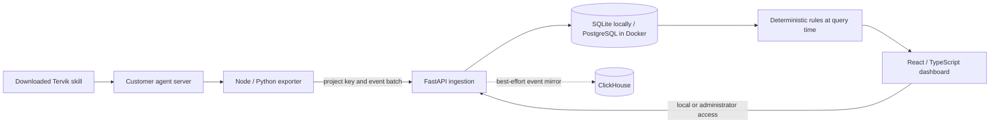

# Architecture: Phase 1

The goal is a functioning vertical slice that can be verified before adding distributed analysis. Tervik's code is written from scratch. The Agnost website and public integration repositories inform the product workflow; they do not establish its private backend framework, frontend framework, queue, account database, or complete deployment topology.

## Implemented components

- **Dashboard:** React, TypeScript, Vite, Lucide icons, responsive CSS. API-backed charts and investigation views.
- **API:** Python, FastAPI, Pydantic, SQLAlchemy. Atomic validation and durable SQL commit before acknowledging ingestion.
- **Configuration and events:** SQLite in zero-configuration local mode; PostgreSQL through the same SQLAlchemy models in the container setup. Unique `(project_id, event_id)` constraints deduplicate retries. Internal conversation identifiers are derived from project plus customer conversation ID.
- **Analytical mirror:** ClickHouse MergeTree event table with project and timestamp ordering. Mirror failures cannot invalidate committed SQL events, but failed mirrors are not retried in Phase 1.
- **Instrumentation:** TypeScript SDK plus portable Node/Python clients, bounded queues, explicit flush/shutdown, stable IDs, transient-error retries, and drop reporting. These are server-side clients.
- **Skill distribution:** `skills/tervik/SKILL.md` with integration guidance and clients. A reproducible ZIP is generated from those same files for the dashboard download.
- **Checks:** native Node test runner, pytest, a full SDK/API smoke test, and GitHub Actions.

## Deliberate limits

The SQL store remains the dashboard source of truth, including event payloads. The service reads a project's retained events and applies deterministic rules at query time. That is suitable for this local foundation, not high-volume production traffic. Generic rule groups are not the embedding/semantic clustering described by Agnost. There is no finished durable queue, rule worker, replay runner, or customer deployment connector.

Administrator access in this phase is a single optional server token. It provides no organization membership, account login, or per-user permissions. Ingestion keys are project-scoped; the administrator can inspect all projects on that instance. Local mode is bound to loopback; container mode requires the token. Project keys are stored retrievably to support local integration setup and need lifecycle/encryption controls before a public SaaS launch.

## Next infrastructure gates

Before public deployment: account and organization boundaries, key rotation/revocation, migrations, pagination/retention, a durable ingestion outbox or queue, retryable ClickHouse delivery, analytics queries backed by ClickHouse, and operational monitoring. Before automated fixes: evidence quality benchmarks, a customer-controlled evaluation runner, approval, isolated delivery, and rollback. These are future work, not implemented features.

## Reference evidence

- [Agnost product workflow](https://agnost.ai/): conversation monitoring, investigation, skills, and reviewed improvements.
- [Agnost public GitHub organization](https://github.com/AgnostAI): public integration repositories; core service code is not published there.
- [Agnost integration skill](https://github.com/AgnostAI/skills): skill-based setup pattern.

React/Vite, FastAPI, PostgreSQL, and this local topology are Tervik implementation choices. They are not asserted to be Agnost's undisclosed internal stack.
